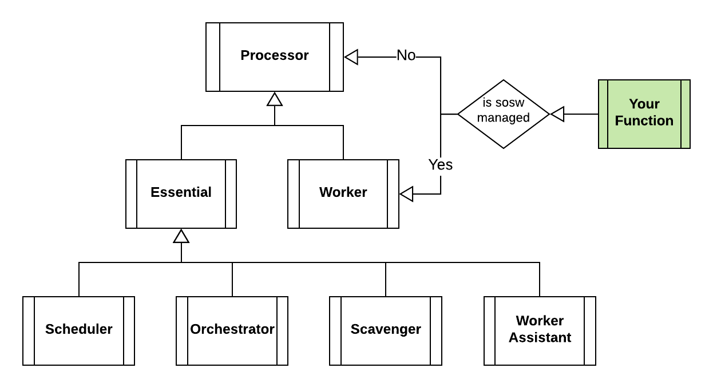

==========
Essentials
==========

``Processor`` is the prototype class that may be used as base class for both ``Processors`` of your Lambda functions and components.

The two child classes ``Essential`` and ``Worker`` are used for Lambda functions.
``Essential`` implements the methods and properties for ``sosw`` essential Lambdas, while the ``Worker``
has the mechanisms for your custom functions that are being orchestrated by ``sosw``.

..  toctree::
    :titlesonly:
    :caption: Essentials:

    processor
    worker
    essential

    orchestrator
    scheduler
    scavenger
    worker_assistant
