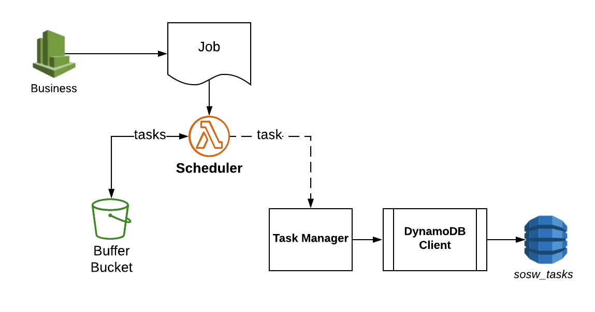

.. _Scheduler:

---------
Scheduler
---------

Scheduler is the public interface of ``sosw`` for any applications who want to invoke some orchestrated Lambdas.
It's main role is to transform some business job to the actual payload of Lambda invocations. It respects the
configurable rules for chunking specific for different workers.

   Scheduler Workflow

..  code-block:: python

    TASKS_TABLE_CONFIG = {
        'row_mapper':       {
            'task_id':             'S',
            'labourer_id':         'S',
            'greenfield':          'N',
            'attempts':            'N',
            'closed_at':           'N',
            'completed_at':        'N',
            'desired_launch_time': 'N',
            'arn':                 'S',
            'payload':             'S'
        },
        'required_fields':  ['task_id', 'labourer_id', 'created_at', 'greenfield'],
        'table_name':       'sosw_tasks',
        'index_greenfield': 'sosw_tasks_greenfield',
        'field_names':      {
            'task_id':     'task_id',
            'labourer_id': 'labourer_id',
            'greenfield':  'greenfield',
        }
    }

    TASK_CLIENT_CONFIG = {
        'dynamo_db_config':                  TASKS_TABLE_CONFIG,
        'sosw_closed_tasks_table':           'sosw_closed_tasks',
        'sosw_retry_tasks_table':            'sosw_retry_tasks',
        'sosw_retry_tasks_greenfield_index': 'labourer_id_greenfield',
        'ecology_config':             {},
        'labourers':                         {
            'some_function': {
                'arn':                          'arn:aws:lambda:us-west-2:0000000000:function:some_function',
                'max_simultaneous_invocations': 10,
            },
        },
    }

    SCHEDULER_CONFIG = {

        'queue_bucket':       'some-bucket',

        'task_config': TASK_CLIENT_CONFIG,
        'job_schema': {},
        'job_schema_variants': {
            'default': {
                'chunkable_attrs': [
                    # ('section', {}),
                    # ('store', {}),
                    # ('product', {}),
                ]
            }
        }
    }

Job Schema
----------

After the Scheduler has parsed and validated the job from the event, it provides `custom_config` from this job.
In case the `job_schema_name` is passed, a certain `job_schema` type will be applied from `job_schema_variants`,
otherwise it takes the default one.
Each time the Scheduler is called it overwrites the `custom_config` and use new specified `job_schema` type.

.. automodule:: sosw.scheduler
   :members:
