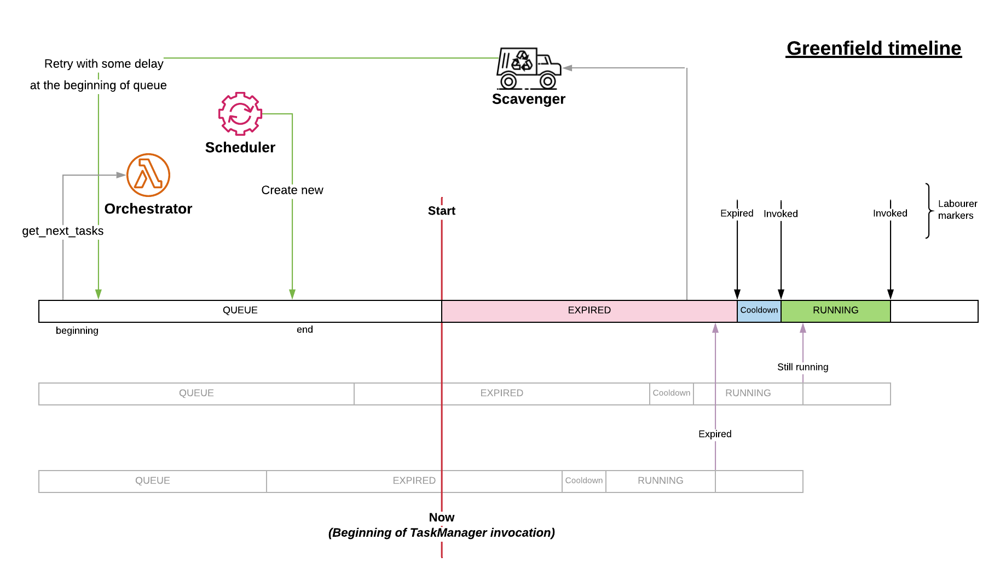

.. _Greenfield:

Greenfield
----------

`Greenfield` is a numeric field of the ``task`` used mainly by
:ref:`TaskManager<task>` to identify the current state of the ``task``.
The values in most states represent ``timestamps``.
TaskManager can easily identify the state by
comparing the current time with the ``greenfield``.

Possible states:

* Queued
* Invoked

  * Completed
  * Expired
  * Running

The following diagram represents different states.

   Greenfield Timeline
