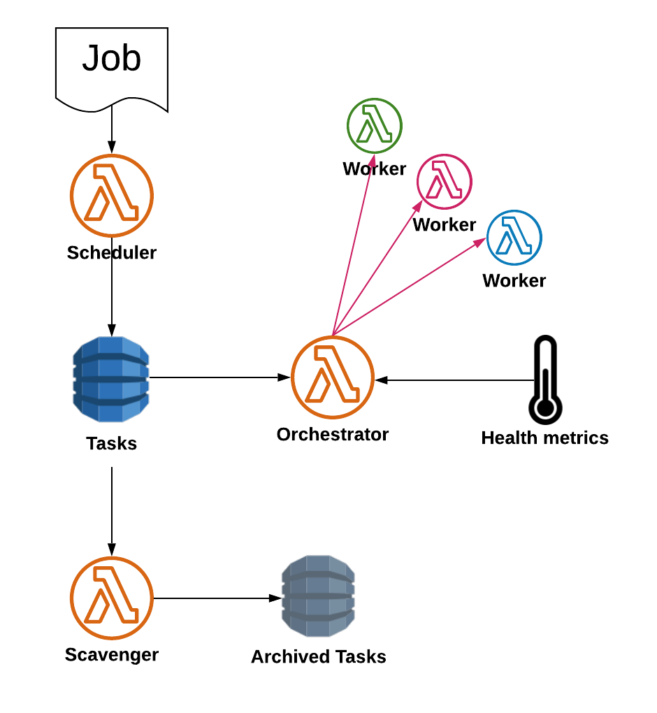

.. title:: Orchestration with ``sosw``

Essential Workflow Schema
-------------------------

Workers
-------
The **Worker** functions themselves are **your** functions that require Orchestration. ``sosw`` package
has multiple components and tools that we encourage you to use in your Workers to make the code DRY and stable:
statistic aggregation, components initialization, configuration automatic assembling and more...

In order to be Orchestrated by ``sosw``, the functions should be able to mark tasks they receive as `completed`
once the job is done. If you inherit the main classes of your Lambdas from :ref:`Worker` this will be handled
automatically. The default behaviour of Workers is not to touch the queue, but to call a :ref:`Worker Assistant`
lambda to mark tasks as completed.

Read more: :ref:`Worker`

------

There could be defined three different Workflows.

Scheduling
----------

Scheduling is transformation of your business jobs to specific tasks for Lambda :ref:`Worker`.
One task = one invocation of a Worker. Scheduler provides an interface for your Business Applications, other Lambdas,
Events (e.g. Scheduled Rules) to provide the Business Job.

Chunking of the Payload happens following the rules that you pre-configure.
One of the built-in dimensions for chunking is calendar.

Scheduled tasks go to a stateful queue to be invoked when the time comes.

Read more: :ref:`Scheduler`

Orchestration
-------------

The :ref:`Orchestrator` is called automatically every minute by `AWS EventBridge Scheduler`_.
It evaluates the status of Workers at the current moment, the health of external metrics
the Workers may depend on (e.g CPU lod of some DB, IOPS, etc.) and invokes the appropriate
amount of new parallel invocations.

Read more: :ref:`Orchestrator`

Scavenger
---------

The :ref:`Scavenger` is called automatically every minute by `AWS EventBridge Scheduler`_.
It collects the tasks marked as ``completed`` by the Workers and archives them.

If the task did not successfully accomplish it tries to re-invoke it with configurable exponential delay.
In case the task completely fails after several invocations, the Scavenger marks it is ``dead`` and removes
from the queue to avoid infinite retries. In this case some external alarm system: SNS or Lambda
may be triggered as well.

Read more: :ref:`Scavenger`

Installation
------------

:ref:`Installation Guidelines`

**`sosw`** requires you to implement/deploy several Lambda functions (Essentials) using the appropriate core classes.
The deployment is described in details, but assumes that you are familiar with basic AWS Serverless products.

Another deployment requirement is to create several `DynamoDB` tables.

| You can find the Cloudformation template for the databases in `the example`_.
| If you are not familiar with CloudFormation, we highly recommend at least learning the basics from `the tutorial`_.

Once again, the detailed guide for initial setup can be found in the :ref:`Installation Guidelines`.

.. _the example: https://raw.githubusercontent.com/sosw/sosw/master/examples/yaml/initial/sosw-dev-shared-dynamodb.yaml
.. _the tutorial: https://docs.aws.amazon.com/AWSCloudFormation/latest/UserGuide/GettingStarted.Walkthrough.html
.. _AWS EventBridge Scheduler: https://docs.aws.amazon.com/eventbridge/latest/userguide/using-eventbridge-scheduler.html