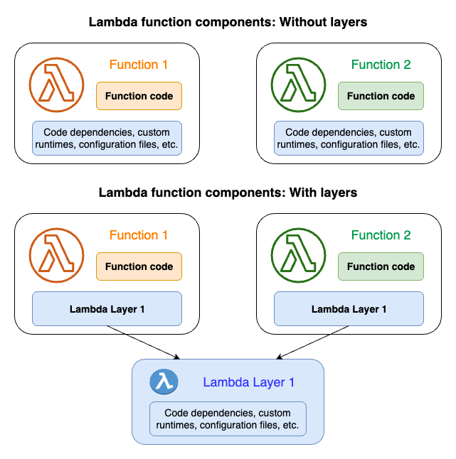

.. _SOSW Layer:

========================
Lambda Layer
========================

A Lambda layer is a .zip file archive that contains supplementary code or data.
Layers usually contain library dependencies, a custom runtime, or configuration files.

You can find full documentation `here
<https://docs.aws.amazon.com/lambda/latest/dg/chapter-layers.html>`_.

The following diagram represents how does Lambda layer work.

In general, you might want to create a Lambda layer whenever you have code or dependencies
that need to be shared or managed independently of your function code.
Creating a layer can help you simplify the deployment process, improve code reuse,
and make it easier to manage dependencies across multiple functions.

========================
SOSW Layer
========================

SOSW layer encapsulates essential components implemented as AWS Lambda functions,
facilitating the orchestration of asynchronous invocations of Lambda functions within
the AWS ecosystem. The SOSW library simplifies the management of distributed tasks and workflows
in serverless applications, offering features such as asynchronous invocation, fault tolerance,
scalability, monitoring, and logging. By utilizing the SOSW layer, developers can efficiently
orchestrate serverless workflows, streamline task execution, and enhance the resilience and scalability
of their serverless applications.

------------------
How to start
------------------

Create ``deploy.sh`` file by using
`deploy.sh
<https://link_to_file.com>`_.

------------------
How to run
------------------

While in the same folder as your ``deploy.sh`` file just run:

..   code-block:: bash

    ./deploy.sh [-v branch] [-p profile]

Installs SOSW from latest pip version, or from a specific branch if you use -v.
Use -p in case you have specific profile (not the default one) in your .aws/config with appropriate permissions.
It will create a folder with all dependencies. You only need to pack it into zip-archive.

------------------
What's next?
------------------

You simply need to load layer zip file to your s3 bucket and deploy
Lambda layer with CloudFormation or AWS SAM by using one of the following templates.

----------------------
Initial Layer creation
----------------------
------------------
CloudFormation
------------------

To deploy a layer by CloudFormation you will need to create a ``.yaml`` file with `sosw-layer.yaml
<https://link_to_file.com>`_.

And after create a stack in AWS CloudFormation.
To create a stack you run the ``aws cloudformation create-stack`` command.
You must provide the stack name, the location of a valid template, and any input parameters.

..   code-block:: bash

    aws cloudformation create-stack \
      --stack-name myteststack \
      --template-body file:///home/testuser/mytemplate.json \
      --parameters ParameterKey=Parm1,ParameterValue=test1 ParameterKey=Parm2,ParameterValue=test2

Or upload it directly via GUI.

------------------
AWS SAM
------------------

To deploy layer with AWS SAM you will simply need to create two files ``samconfig.toml`` and ``template.yaml``
which are represented below.

`samconfig.toml
<https://link_to_file.com>`_

`template.yaml
<https://link_to_file.com>`_

After you create these files you can run them just by entering ``sam build && sam deploy`` in your console.

----------------------------------------------------
How to connect an AWS Layer to your Lambda Function?
----------------------------------------------------

Connecting a layer to a Lambda resource in AWS CloudFormation involves specifying the ARN (Amazon Resource Name) of the layer
when defining the Lambda function. This connection enables the Lambda function to utilize the code and dependencies provided by
the layer.

Here's a basic CloudFormation template snippet demonstrating how to connect a layer to a Lambda function:

..   code-block:: yaml

    Resources:
  MyLambdaLayer:
    Type: AWS::Lambda::LayerVersion
    Properties:
      ContentUri: my_sosw_layer.zip
      CompatibleRuntimes:
        - python3.8
        - python3.9
        - python3.10
        - python3.11

  MyLambdaFunction:
    Type: AWS::Lambda::Function
    Properties:
      Code:
        S3Bucket: my_bucket
        S3Key: my_function.zip
      Handler: app.lambda_handler
      Runtime: python3.11
      Layers:
        - !Ref MyLambdaLayer

------------
Update Layer
------------

To update a layer version:

1.  **Publish a New Version:** Make changes to your layer code or configuration and publish a new version using the AWS Lambda console,
AWS CLI, or SDK. Lambda will automatically increment the version number and create a new layer version.

2.  **Update CloudFormation Templates:** After publishing a new layer version, update your CloudFormation templates to reference the latest version ARN.
Ensure that the ContentUri property points to the updated layer content, and update any other relevant properties if necessary.

3.  **Update CloudFormation Stacks:** Once your templates are updated, use AWS CloudFormation or SAM to update the stacks that use the updated layer.
This will apply the changes and ensure that functions within your stacks use the latest layer version.

------------------
Versions
------------------

A layer version is an immutable snapshot of a specific version of a layer.
When you create a new layer, Lambda creates a new layer version with a version number of 1.
Each time you publish an update to the layer, Lambda increments the version number and creates a new layer version.

Every layer version is identified by a unique Amazon Resource Name (ARN).
When adding a layer to the function, you must specify the exact layer version you want to use.

You can use `layers_versions_changer.py
<https://link_to_file.com>`_ to automate the process of updating layer versions across all CloudFormation and SAM templates in your project.
This script intelligently replaces placeholders in your templates with the actual layer version, ensuring that functions within your project
automatically use the latest layer versions without manual intervention. This streamlines the management of layer versions across your serverless applications,
improving efficiency and ensuring consistency in your deployment process.

**Note:** Ensure to update the layer version in your CloudFormation templates when necessary, especially when introducing changes or fixes to your layer code.
This ensures that your functions utilize the latest enhancements and improvements provided by the updated layer versions.
